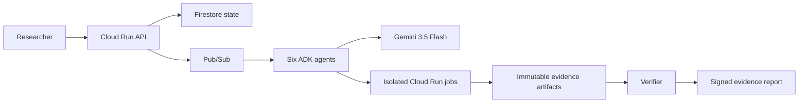

# Replicator

**Evidence, not vibes.** Replicator is an autonomous scientific-verification system. Give it an
arXiv paper and explicit cost, runtime, and repair limits; it extracts quantitative claims, designs a
bounded experiment, generates and validates code, runs the experiment in an isolated Google Cloud
job, repairs failures within budget, and returns an evidence-backed verdict.

[](https://replicator-api-821279770160.europe-west1.run.app/)
[](https://console.cloud.google.com/run?project=replicator-agentic-bowei)
[](#evidence-not-opinions)

**Live application:** https://replicator-api-821279770160.europe-west1.run.app/


## Current status

Replicator is deployed in `replicator-agentic-bowei` on Google Cloud in `europe-west1`. The complete
cloud workflow has been exercised against real arXiv papers: paper ingestion, Gemini claim extraction,
bounded planning, generated experiment builds, isolated Cloud Run execution, autonomous retries,
artifact-backed verification, signed reporting, persistent run history, and repair memory.

The system also handles the two scientifically important non-success cases honestly:

- **Infeasible claim:** the planner records `NOT_ATTEMPTED` without spending the experiment budget.
- **Execution failure:** the runner records a system failure and produces no scientific verdict.

| Capability | Status |
|---|---|
| Public Mission Control UI and API | Live on Cloud Run |
| arXiv PDF text and figure ingestion | Live and exercised |
| Gemini 3.5 Flash structured claim extraction | Live on Vertex AI |
| Six-stage Reader → Planner → Builder → Runner → Verifier → Reporter workflow | Live |
| Cloud Build experiment-image generation | Live and exercised |
| Isolated, budget-capped Cloud Run experiment jobs | Live and exercised |
| Autonomous diagnose → repair → retry loop | Live and exercised |
| Artifact-backed numerical verdicts | Live and exercised |
| Fail-closed handling of skipped and failed experiments | Live and exercised |
| Firestore mission state, run archive, and repair memory | Live |
| Signed evidence reports and shareable report URLs | Live |
| Terraform deployment and CI quality gates | Implemented |

One captured end-to-end cloud execution is documented in [the Devpost evidence draft](docs/DEVPOST.md),
including its run ID, trace ID, immutable image digest, runtime, and accounted cost.

## Architecture at a glance


The API, asynchronous worker fleet, durable state, isolated experiment runtime, immutable artifacts,
and signed reporting path are shown above. A simplified judge-friendly flow appears in the
[Architecture](#architecture) section below.

## Why it matters

Reproducing a result can take a researcher days or weeks: read the paper, isolate the precise claim,
find the data, reconstruct the environment, repair dependencies, execute safely, and decide whether
the observed result actually supports the publication.

Most AI assistants can describe those steps. Replicator owns the asynchronous operational loop and
produces inspectable evidence. A researcher can launch a mission, leave the page, and return later to
the complete run history and evidence ledger.

## What happens during a mission

1. **Reader** downloads the paper, extracts text and figures, and identifies quantitative claims.
2. **Planner** selects a feasible claim and creates a test constrained by the submitted guardrails.
3. **Builder** generates immutable experiment source, validates it, and requests a reproducible image.
4. **Runner** executes the image in an isolated Cloud Run job and repairs failures within the attempt cap.
5. **Verifier** compares reported values with actual `metrics.json` measurements and attached artifacts.
6. **Reporter** creates the final evidence ledger and signs the report trail.

The UI exposes each stage, current activity, elapsed time, attempts, accounted spend, next action, and
the final distinction between a scientific outcome and a system outcome.

## Evidence, not opinions

Replicator is intentionally fail-closed:

- A numerical verdict cannot exist without a persisted measurement artifact.
- An infrastructure or generated-code failure is not evidence against a paper.
- An experiment that exceeds the mission limits is marked `NOT_ATTEMPTED`, not silently downscaled.
- Paper, repository, and dataset content are treated as untrusted data—not agent instructions.
- Every verdict links the claim, protocol, dataset provenance, code, logs, metrics, cost, and trace.

This makes negative and incomplete outcomes useful: they reveal exactly what was tested, what failed,
and what remains unknown without manufacturing certainty.

## Architecture



| Layer | Google Cloud service | Responsibility |
|---|---|---|
| Control plane | Cloud Run service | Intake, guardrails, UI, API, SSE mission updates, reports |
| Agent fleet | Cloud Run services + Google ADK | Reader, planner, builder, runner, verifier, and reporter decisions |
| Reasoning | Gemini 3.5 Flash on Vertex AI | Multimodal extraction, structured planning, diagnosis, and repair |
| Event backbone | Pub/Sub | Authenticated asynchronous delivery, retries, and dead letters |
| Durable state | Firestore | Mission state, idempotency, attempts, verdicts, and learned repairs |
| Experiment sandbox | Cloud Run Jobs | Ephemeral execution with runtime and identity boundaries |
| Evidence | Cloud Storage | PDFs, source bundles, logs, metrics, figures, and reports |
| Build provenance | Cloud Build + Artifact Registry | Reproducible containers and immutable image digests |
| Security | IAM + Secret Manager | Dedicated identities and externally managed credentials |
| Observability | Cloud Logging + Cloud Trace | Correlated structured events and end-to-end mission traces |

More detail is available in [the architecture notes](docs/architecture.md),
[architecture decisions](docs/DECISIONS.md), and [security model](docs/SECURITY.md).

## Run locally

### Requirements

- Python 3.11+
- Git

### Five-command setup

```powershell
git clone https://github.com/Boweii22/Replicator.git replicator
cd replicator
python -m venv .venv
.\.venv\Scripts\pip install -e ".[dev]"
.\.venv\Scripts\uvicorn services.api.main:app --reload --port 8080
```

Open http://localhost:8080. API documentation is available at http://localhost:8080/docs.

Local mode exercises the interface, orchestration contracts, and artifact-backed calibration path. A
real arXiv mission requires the Google Cloud services and identities provisioned by the deployment.

### Run the quality gates

```powershell
.\.venv\Scripts\ruff check .
.\.venv\Scripts\pytest
```

## Deploy to Google Cloud

Authenticate with `gcloud`, choose a billed project, install Terraform, and run:

```powershell
.\scripts\deploy.ps1 -ProjectId YOUR_PROJECT_ID -Region europe-west1
```

The deployment wrapper:

1. enables the required Google Cloud APIs;
2. provisions Artifact Registry and dedicated service accounts;
3. builds and pushes the application image with Cloud Build;
4. applies the Cloud Run API, workers, jobs, Pub/Sub, Firestore, Storage, IAM, and observability stack;
5. prints the deployed API URL.

Terraform provisions Secret Manager containers but never secret values. Add required secret versions
after provisioning; never commit credentials to this repository.

## Repository map

```text
apps/        Mission Control web interface
services/    API and asynchronous worker entry points
packages/    Agents, domain models, orchestration, adapters, evidence, and telemetry
runner/      Isolated experiment runtime contract
infra/       Terraform for the Google Cloud deployment
scripts/     Deployment and operational helpers
tests/       Unit, contract, integration, and security tests
docs/        Architecture, judging evidence, demo material, and submission drafts
demo/        Standalone motion-design scenes used in the demo video
```

## Demonstration portfolio

The locked paper portfolio and intended claim scopes are documented in
[docs/DEMO_PAPERS.md](docs/DEMO_PAPERS.md). The deployed application has also been exercised with both
small reproducible papers and deliberately infeasible papers, including *Attention Is All You Need*,
to prove that budget enforcement and honest refusal are part of the product—not presentation copy.

## Hackathon submission material

- [Judging evidence](docs/JUDGING.md)
- [Demo script](docs/DEMO_SCRIPT.md)
- [Devpost draft](docs/DEVPOST.md)
- [Architecture diagram](docs/architecture.png)
- [Build article draft](docs/BLOG_DRAFT.md)
- [Social post draft](docs/SOCIAL_DRAFT.md)
- [Demo paper portfolio](docs/DEMO_PAPERS.md)

The final demo video URL will be added after upload.

## Safety invariants

- Pub/Sub redelivery cannot duplicate side effects: workers claim `event_id` transactionally.
- Budgets are typed inputs and enforced before dispatch and retry.
- Experiment runners use a separate restricted identity.
- Artifact paths and generated source are validated before execution.
- Public artifact access is prevented at the bucket level.
- Verdicts are derived from persisted evidence, never free-form model prose.

Replicator does not promise that every paper is cheaply reproducible. It promises to show—honestly,
traceably, and within explicit limits—what was attempted, what was measured, and what remains unproven.
