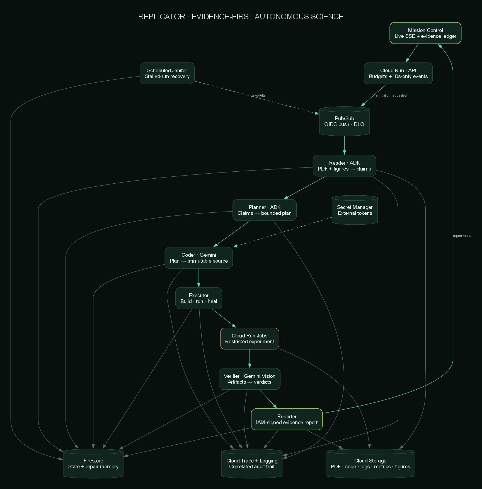

# Replicator

**Evidence, not vibes.** Replicator is an autonomous scientific replication system: give it an arXiv
paper and a hard budget; it extracts quantitative claims, plans and runs sandboxed experiments,
self-heals failures, and returns a signed evidence graph connecting every verdict to code, logs,
metrics, figures, cost, and trace spans.



> Status: Phase 2 reader slice. The API, typed state contract, idempotent event path, secure arXiv
> ingestion, PDF/image extraction, prompt-injection screening, ADK reader definition, Vertex Gemini
> structured claim extraction, immutable artifact adapter, deterministic verdict rubric, SSE stream,
> Google Cloud Terraform, and tests are implemented. Local mode is explicitly not a fake reproduction.

## Why it matters

Reproducing one result can take a researcher days. Existing assistants can suggest code; Replicator
owns the asynchronous operational loop and is rewarded for finding honest failures. Its durable failure
memory means a broken dependency repaired for one paper becomes evidence-backed operational knowledge
for the next.

## Spin-up in 5 commands

```powershell
git clone <YOUR_REPOSITORY_URL> replicator
cd replicator
python -m venv .venv
.\.venv\Scripts\pip install -e ".[dev]"
.\.venv\Scripts\uvicorn services.api.main:app --reload --port 8080
```

Open `http://localhost:8080/docs`. Create a run with `POST /replications`, inspect it with
`GET /replications/{id}`, and follow `GET /replications/{id}/events` as an SSE stream.

## Cloud deployment

Build and push an immutable image, then run:

```powershell
terraform -chdir=infra init
terraform -chdir=infra apply -var="project_id=YOUR_PROJECT" -var="image=REGION-docker.pkg.dev/YOUR_PROJECT/replicator/app@sha256:DIGEST"
```

Secret *containers* are provisioned, but secret values are deliberately never handled by Terraform.
Add versions using Secret Manager after apply.

## What runs where on Google Cloud

| Component | Google Cloud product | Responsibility |
|---|---|---|
| API and agent workers | Cloud Run services | Intake, ADK decisions, SSE, verification, reporting |
| Experiment sandboxes | Cloud Run Jobs | Capped, ephemeral execution outside agent containers |
| Event backbone | Pub/Sub | IDs-only events, authenticated push, retries and dead letters |
| Canonical state and memory | Firestore | Transactional idempotency, attempts, verdicts, learned fixes |
| Evidence artifacts | Cloud Storage | PDFs, immutable code, logs, metrics, figures and reports |
| Images | Artifact Registry + Cloud Build | Reproducible service and experiment images |
| Models | Vertex AI | Gemini 3.5 Flash multimodal reasoning and structured output |
| Secrets | Secret Manager | GitHub/Hugging Face credentials; no committed keys |
| Audit trail | Cloud Trace + Cloud Logging | One trace per replication; correlated structured events |

## Safety invariants

- A verdict value must reference an actual `metrics.json` artifact.
- Pub/Sub redelivery cannot duplicate side effects: workers claim `event_id` transactionally.
- Paper and repository content are untrusted data, never instructions.
- Budgets are typed inputs and enforced before dispatch and retry.
- Experiment runners use a separate identity with object-create-only artifact access.

See [architecture decisions](docs/DECISIONS.md) and the Terraform in `infra/`.

Submission materials: [judging evidence](docs/JUDGING.md), [demo script](docs/DEMO_SCRIPT.md),
[Devpost draft](docs/DEVPOST.md), [article draft](docs/BLOG_DRAFT.md), and
[social draft](docs/SOCIAL_DRAFT.md).

## Implementation ledger

| Capability | State |
|---|---|
| API, budgets, SSE mission stream | Implemented and tested |
| Secure arXiv PDF ingestion | Implemented and tested |
| PDF text and embedded-image extraction | Implemented; needs a representative-paper fixture |
| Gemini structured quantitative claims | Implemented; requires Vertex credentials for live test |
| Budget-aware experiment planning and runner contract | Implemented and tested |
| Capped executor fail → diagnose → repair → retry loop | Implemented with runner interfaces and tests |
| Deterministic experiment bundles and Cloud Build request | Implemented and tested |
| Restricted Cloud Run Jobs adapter and Gemini code repairer | Implemented; live GCP test pending |
| Artifact-backed numerical verifier and tamper-evident reporter | Implemented and tested |
| Gemini multimodal scientific figure assessment | Implemented; live Vertex test pending |
| Evidence ledger UI and report endpoint | Implemented and tested |
| Firestore-backed cloud API and idempotent reader push worker | Implemented; live GCP test pending |
| Fresh-project Cloud Build + Terraform deployment script | Implemented; Terraform CLI validation pending |
| Planner → executor → verifier → IAM-signed reporter cloud workers | Implemented and contract-tested |
| Pub/Sub failure redelivery claim release | Implemented and tested |
| Live Google Cloud deployment and captured proof | Requires target project authentication |

No row marked “next” is represented as working in the interface or submission materials.
