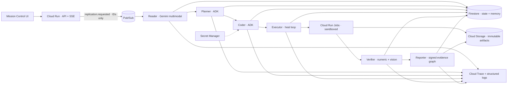

# Architecture

Every arrow across a service boundary is replay-safe. Workers transactionally claim the event ID,
reload canonical state, perform one bounded side effect, persist its evidence, and only then emit the
next ID-only event. Experiment code never runs in an agent service.

